# <div style="margin:10px 0px; font-size:50px;" align="center">🖥️ Windows 11</div>

Welcome to the **Windows Clone** app built with **React.js**! 🎉 Dive into this interactive simulation of the Windows operating system, packed with apps and features to play around with. Let’s get started!

<p align="center">
    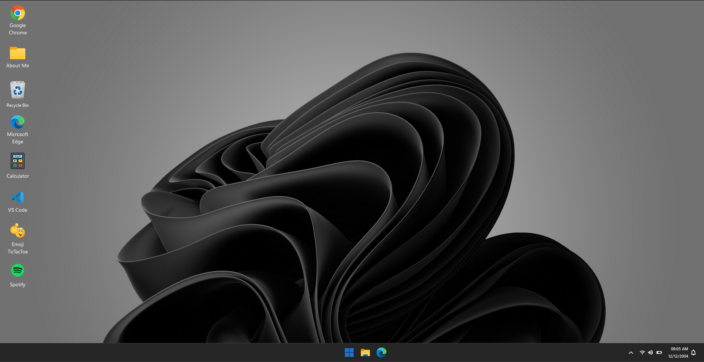
    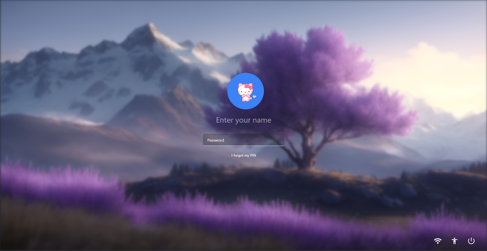
    <p align="center"><strong>You can enter anything on the login page to gain access to the app. No need for actual credentials!</strong></p>
</p>

## <div style="margin-left:10px;">🎨 Features

- **🌐 Chrome**: Surf the web just like in a real Chrome browser.
- **🧮 Calculator**: Perform basic arithmetic operations with this handy calculator.
- **💻 VS Code**: Virtual Visual Studio Code environment.
- **🕹️ Emoji Tic-Tac-Toe**: Play a fun game of Tic-Tac-Toe using emojis!
- **🎵 Spotify**: Enjoy a simulated music player interface.
- **📁 About Me**: Learn about ME.

## <div style="margin-left:10px;">🚀 Installation

To get this project running on your local machine, follow these simple steps:

1. **Clone the repository:**

   ```bash
   git clone https://github.com/MishanPoudel/Windows11-3.0
   ```

2. **Navigate to the project directory:**

   ```bash
   cd Windows11-3.0
   ```

3. **Install the dependencies:**

   ```bash
   npm install
   ```

4. **Start the development server:**

   ```bash
   npm start
   ```

   Your app will open in your default web browser at [http://localhost:3000](http://localhost:3000) 🎉

## <div style="margin-left:10px;">💻 Usage

- **Login Page**: You can enter anything on the login page to gain access to the app. No need for actual credentials! 🔐
- Click on the icons on the desktop to open the different apps.
- Use the taskbar to switch between open applications.
- Interact with the apps to explore their features and functionalities!

## <div style="margin-left:10px;">🛠️ Technologies Used

- **React.js**: For building the interactive user interface.
- **Tailwind CSS**: For styling the components and creating a desktop-like experience.
- **React Router DOM**: For managing navigation and routing within the app.
- **Framer Motion**: For adding animations and transitions.
- **React Draggable**: For making elements draggable.

## <div style="margin-left:10px;">🤝 Contributing

Want to contribute? We’d love your help! Fork the repository, make your changes, and submit a pull request. Please follow the coding standards and include tests where necessary.

## <div style="margin-left:10px;">⭐ Support

If you enjoy this project or find it useful, please consider giving it a star on [GitHub](https://github.com/MishanPoudel/Windows11-3.0). Your support means a lot and helps encourage further development! 🌟

## <div style="margin-left:10px;"> Contact

Got questions or feedback? Reach out at [your-email@example.com](mailto:poudelmishan2@gmail.com). We’d love to hear from you!

## <div style="margin-left:10px;">🚧 Note

I’m a beginner in React.js and web development, so my code might not be perfect. I’m constantly learning and improving, so any constructive feedback is appreciated!

## <div style="margin-left:10px;">📸 Screenshots

<p align="center">
    
    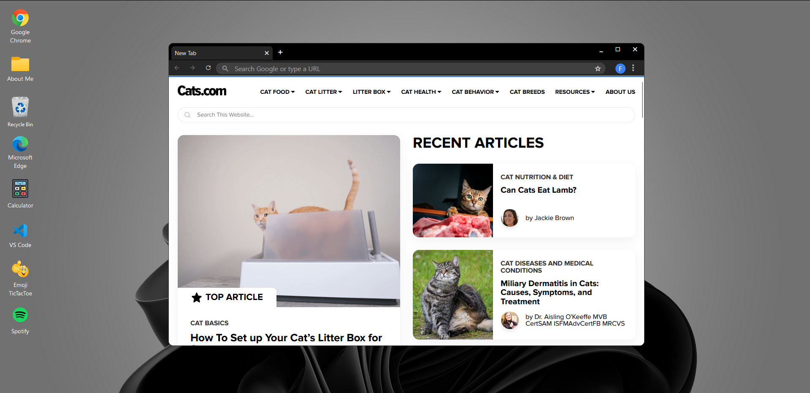
    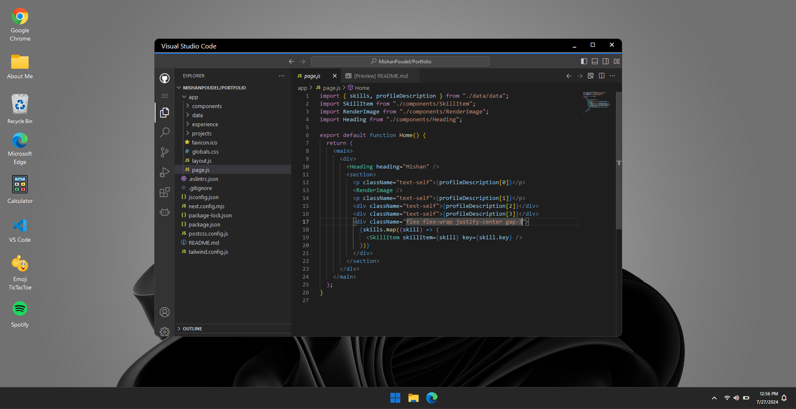
    
    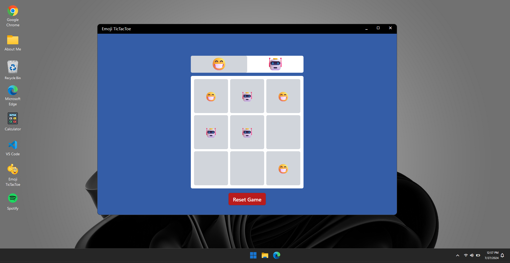
    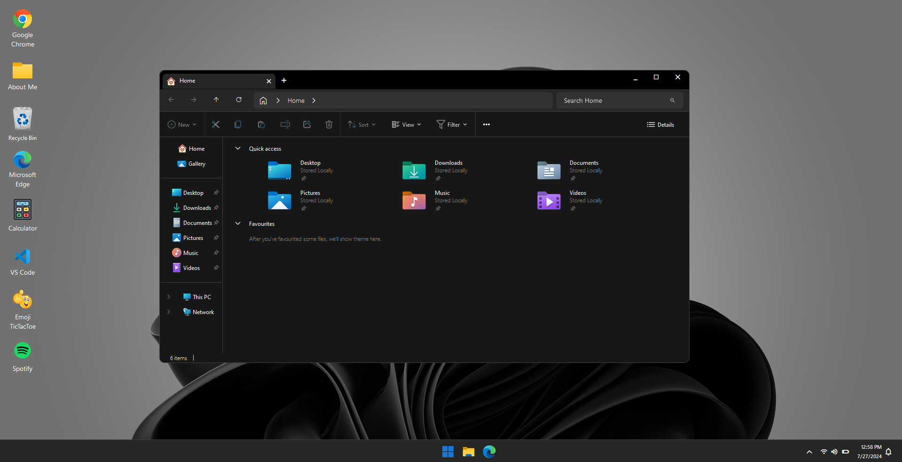
    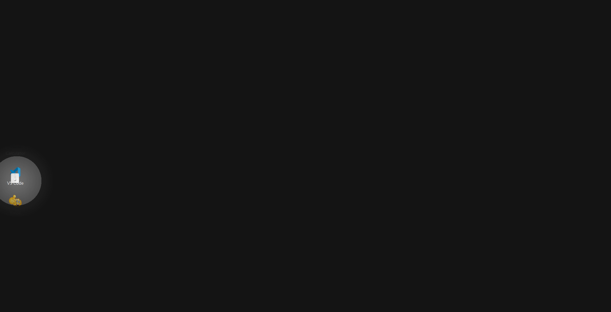
    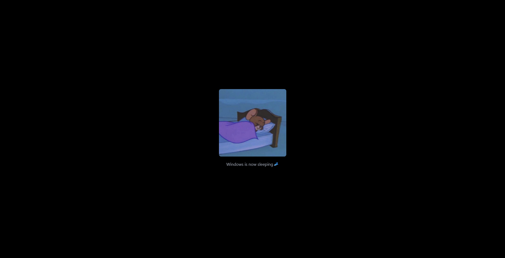
    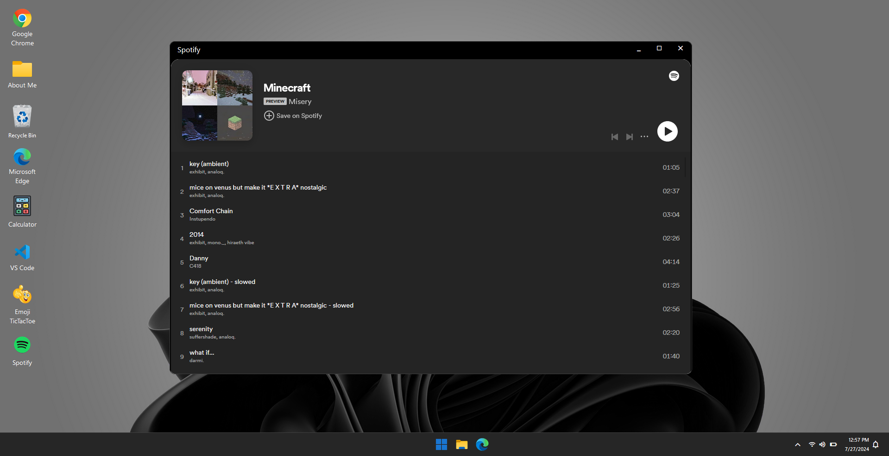
    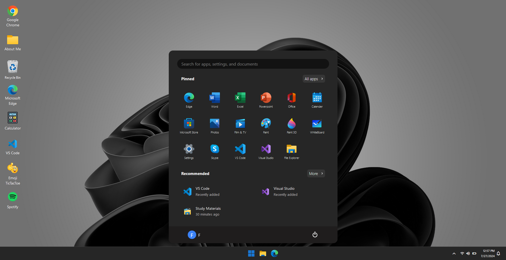
    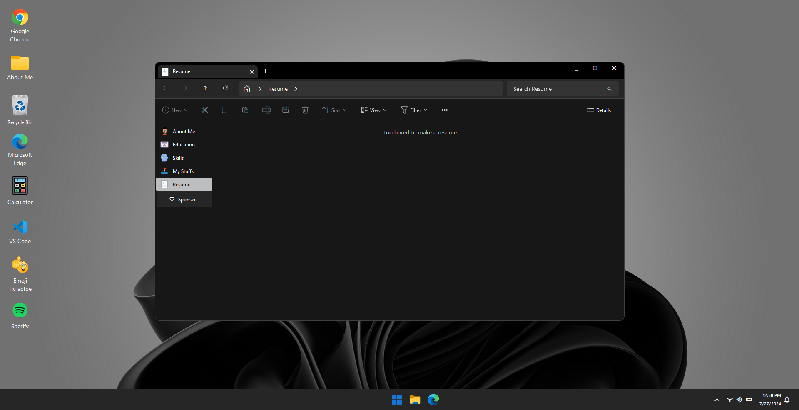
</p>

## <div style="margin-left:10px;"> 💡 Inspiration

This project was slightly inspired by [Vivek Patel's portfolio](https://vivek9patel.github.io/). Check it out for more creative ideas and inspiration!

<p align="center">
  
</p>

<div style="margin:20px; font-size:20px;"><strong>Enjoy exploring your Windows Clone app! 🎉💻🖱</strong>
